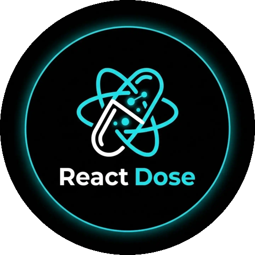

<p align="center">
  
</p>

<h1 align="center">create-react-dose</h1>

<p align="center">
  <strong>React Dose CLI</strong> — a feature-first scaffolding toolchain for React applications.<br />
  It does not reinvent Vite, Next.js, or React Router — it <strong>builds on top of them</strong> with a disciplined architecture that stays scalable as your product grows.
</p>

<p align="center">
  Created and owned by <a href="https://github.com/mohamed-elshami"><strong>Mohamed Samir Elshami</strong></a>
  &nbsp;·&nbsp;
  <a href="https://github.com/mohamed-elshami">GitHub</a>
  &nbsp;·&nbsp;
  <a href="https://www.linkedin.com/in/mohamed-samir-dev/">LinkedIn</a>
  &nbsp;·&nbsp;
  <a href="https://mohamed-elshami-dev.vercel.app/">Portfolio</a>
  &nbsp;·&nbsp;
  <a href="https://www.youtube.com/@Fekra-2025">YouTube</a>
</p>

```bash
npx create-react-dose@latest
```

That is the primary way users run this tool — the same pattern as `create-next-app`, `create-vite`, and `create-react-router`.

You can also use:

```bash
npm create react-dose@latest
npx create-react-dose@latest ./my-app
```

---

## Philosophy: Stand on giants, ship structure

Modern React teams already trust battle-tested official tools:

| Official tool | Role |
|---------------|------|
| [**Vite**](https://vite.dev) (`npm create vite`) | Lightning-fast dev server and build tooling for React SPAs |
| [**Create Next App**](https://nextjs.org/docs/app/api-reference/cli/create-next-app) | The official Next.js App Router bootstrap |
| [**Create React Router**](https://reactrouter.com) | Official React Router v7 framework mode (Vite-powered) |

**React Dose does not replace these CLIs.** We run them first — with pinned, compatible major versions — to give you the same foundation the ecosystem maintains, documents, and upgrades.

Then we apply a **second layer**: cleanup, architecture injection, and opinionated templates so every project starts with:

- A **clear separation** between app shell and product code
- **Feature modules** that scale with your domain
- **Shared utilities** and **provider composition** wired from day one
- A **branded landing page** so you see the structure immediately

You keep official tooling. You gain a production-minded folder layout.

```
┌─────────────────────────────────────────────────────────────┐
│  1. Official scaffold   Vite · Next.js · React Router     │
├─────────────────────────────────────────────────────────────┤
│  2. Boilerplate cleanup   Remove demo noise, align entries  │
├─────────────────────────────────────────────────────────────┤
│  3. React Dose injection  Architecture · features · polish  │
└─────────────────────────────────────────────────────────────┘
```

---

## Quick start

### Prerequisites

- **Node.js 18+**
- **npm**, **pnpm**, or **yarn** (auto-detected for install step)

### Create a project

```bash
npx create-react-dose@latest
```

Or pass the target path directly:

```bash
npx create-react-dose@latest ./my-app
```

Follow the interactive prompts. When finished:

```bash
cd my-app
npm run dev
```

---

## Supported stacks

| Stack | Official base | React Dose flavor |
|-------|----------------|-------------------|
| **Vite SPA** | `npm create vite` | Client-side React app with `src/app/main.tsx` + `App.tsx` |
| **React Router v7** | `npx create-react-router` | Framework mode with file-based routes under `src/app/` |
| **Next.js App Router** | `npx create-next-app` | App Router with `src/app/layout.tsx` + feature-driven pages |

Official scaffolder versions are pinned in `scaffold-pins.json` (e.g. Vite 9, Next.js 16, React Router 8). Set `REACT_DOSE_SCAFFOLD_LATEST=1` to use `@latest` instead (useful for testing, not recommended for production scaffolds).

---

## Interactive options

The CLI walks you through these choices:

| Prompt | Options | Notes |
|--------|---------|-------|
| **Project path** | Any folder | Defaults to `./my-react-dose-app` |
| **Framework** | React-vite · Next-app | Determines official scaffolder |
| **Architecture** | SPA · React Router | React-vite only |
| **Linter** | ESLint · Oxlint | Vite SPA only |
| **TypeScript** | Yes / No | JS or TS throughout |
| **React Compiler** | Yes / No | Via official scaffolder flags (not Router) |
| **State** | None · Zustand · Redux Toolkit | Wires providers automatically |
| **Tailwind CSS** | Yes / No | Official integration when enabled |
| **i18n** | Yes / No | `react-i18next` (Vite/Router) or `next-intl` (Next) |

Every optional feature is **metadata-driven** — dependencies, providers, and cleanup are applied consistently without manual wiring.

---

## Architecture: feature-first by design

React Dose enforces a **three-zone** layout. Shell in `app/`, product in `features/`, cross-cutting code in `utils/`.

```
src/
├── app/                    # App shell — routing, layout, providers, global styles
│   ├── main.tsx            # Vite SPA entry
│   ├── App.tsx             # Vite SPA root component
│   ├── root.tsx            # React Router root layout
│   ├── routes/             # React Router route modules
│   ├── layout.tsx          # Next.js root layout
│   ├── page.tsx            # Next.js route entry (thin wrapper → features)
│   ├── providers/
│   │   └── root-provider.tsx
│   └── globals.css / index.css / app.css
│
├── features/               # Domain modules — one folder per feature
│   └── home/
│       ├── pages/
│       │   └── HomePage.tsx
│       ├── components/
│       ├── hooks/
│       ├── services/
│       ├── types/
│       ├── assets/
│       ├── CreatorLinks.tsx
│       ├── creatorLinks.data.ts
│       └── index.ts          # Public barrel exports
│
└── utils/                    # Shared, non-UI helpers
    ├── cookies.ts
    ├── localStorage.ts
    └── index.ts
```

### Why this scales

| Principle | Benefit |
|-----------|---------|
| **Features own their UI and logic** | `home`, `auth`, `billing` stay isolated — no 2,000-line `components/` dump |
| **App shell stays thin** | Routes and providers change rarely; features change constantly |
| **Barrel exports (`index.ts`)** | Import `@/features/home` — not deep paths — keeps refactors safe |
| **`@/*` path alias** | Consistent imports across Vite, Router, and Next |
| **Root provider composition** | Zustand, Redux, i18n, and future wrappers nest in one place |

### What you get on day one

- **Branded landing page** (`HomePage`) with stack-specific docs links (Vite / Router / Next)
- **Creator links** component with typed data module
- **React Dose favicon** in the correct location per stack (`public/` for Next, `index.html` / `root.tsx` for Vite/Router)
- **README** tailored to your stack
- **Utilities** for cookies and `localStorage` patterns

---

## Stack-specific behavior

### Vite SPA

- Official `create-vite` template (`react-ts`, `react`, or React Compiler variants)
- Entry moved to `src/app/main.tsx` with `RootProvider` wrapper
- No `src/app/page.tsx` — that pattern is Next-only
- ESLint or Oxlint per your choice

### React Router v7

- Official `create-react-router` scaffold
- App directory normalized to `src/app/`
- Welcome boilerplate removed; home route points to `@/features/home`
- Landing page badge and docs target **React Router**, not Vite

### Next.js App Router

- Official `create-next-app` with `--app`, `--src-dir`, `@/*` alias, ESLint
- `layout.tsx` ships with React Dose metadata and `RootProvider`
- Favicon lives in **`public/favicon.ico`** (App Router convention via static assets)
- i18n enables `next-intl` with `[locale]` routing when selected

---

## Open-source acknowledgments

React Dose is built **with**, not **against**, the open-source tools that power modern React:

- **[Vite](https://vite.dev)** — MIT License — fast dev/build toolchain
- **[Next.js](https://nextjs.org)** — MIT License — full-stack React framework
- **[React Router](https://reactrouter.com)** — MIT License — routing and framework mode
- **[React](https://react.dev)** — MIT License
- **[Tailwind CSS](https://tailwindcss.com)** — MIT License (when enabled)
- **[Zustand](https://github.com/pmndrs/zustand)** · **[Redux Toolkit](https://redux-toolkit.js.org)** · **[next-intl](https://next-intl.dev)** · **[react-i18next](https://react.i18next.com)** — when selected at scaffold time

We pin major versions of official scaffolders for reproducible projects. When Vite, Next, or React Router release improvements, you still benefit — React Dose adapts the architecture layer on top.

---

## Development & verification

From the monorepo root:

```bash
# Run the CLI locally (interactive)
pnpm cli:dev

# Verify all scaffold combinations (install + build + lint)
pnpm cli:verify

# Scaffold playground apps (vite-ts, router-ts, next-ts)
node packages/cli/scripts/scaffold-playground-all.mjs
```

CI runs `scaffold-verify.mjs` on every push to `main` to guard against regressions.

---

## Environment variables

| Variable | Effect |
|----------|--------|
| `REACT_DOSE_SCAFFOLD_LATEST=1` | Use `@latest` for official scaffolders instead of pinned majors |
| `CI=1` | Used internally for non-interactive spinner behavior |

---

## Project scripts (after scaffold)

| Script | Vite SPA | React Router | Next.js |
|--------|----------|--------------|---------|
| Dev | `npm run dev` | `npm run dev` | `npm run dev` |
| Build | `npm run build` | `npm run build` | `npm run build` |
| Lint | `npm run lint` | — | `npm run lint` |

---

## Monorepo on GitHub · separate packages on npm

React Dose uses **one GitHub monorepo** and **multiple independent npm packages**. That is intentional.

| Where | What |
|-------|------|
| **GitHub** | Single repo: [`react-dose-ecosystem`](https://github.com/mohamed-elshami/react-dose-ecosystem) — CLI, UI, templates, and tooling developed together |
| **npm** | Separate installs — each tool is published on its own |

### npm packages

| Package | Install | Purpose |
|---------|---------|---------|
| **`create-react-dose`** | `npx create-react-dose@latest` | Scaffold new projects (this CLI) |
| **`@react-dose/ui`** | `npm install @react-dose/ui` | Design system components (optional, in your app) |

You do **not** install `create-react-dose` into an existing app for daily use — you run it once to **create** a project. UI is added later as a normal dependency when you need shared components.

Changesets + GitHub Actions publish each package independently from the same monorepo (`pnpm -r publish`).

---

## Contributing

React Dose lives in the [react-dose-ecosystem](https://github.com/mohamed-elshami/react-dose-ecosystem) monorepo:

| Path | npm package |
|------|-------------|
| `packages/cli/` | `create-react-dose` |
| `packages/ui/` | `@react-dose/ui` |

- CLI source: `packages/cli/src/`
- Templates: `packages/cli/templates/`
- Feature metadata: `packages/cli/templates/METADATA.md`

Issues and PRs welcome. Run `pnpm cli:verify` before submitting scaffold-related changes.

---

## Author

**create-react-dose** is created, owned, and maintained by **[Mohamed Samir Elshami](https://github.com/mohamed-elshami)**.

- **Owner:** [Mohamed Samir Elshami](https://github.com/mohamed-elshami)
- **GitHub:** [github.com/mohamed-elshami](https://github.com/mohamed-elshami)
- **LinkedIn:** [linkedin.com/in/mohamed-samir-dev](https://www.linkedin.com/in/mohamed-samir-dev/)
- **Portfolio:** [mohamed-elshami-dev.vercel](https://mohamed-elshami-dev.vercel.app/)
- **YouTube:** [youtube.com/@Fekra-2025](https://www.youtube.com/@Fekra-2025)

Issues, ideas, and PRs are welcome in the [React Dose repository](https://github.com/mohamed-elshami/react-dose-ecosystem).

---

## License

MIT © [Mohamed Samir Elshami](https://github.com/mohamed-elshami)

---

<p align="center">
  <strong>Ship features, not boilerplate.</strong><br />
  Built with respect for Vite, Next.js, and React Router — enhanced with architecture that lasts.
</p>
